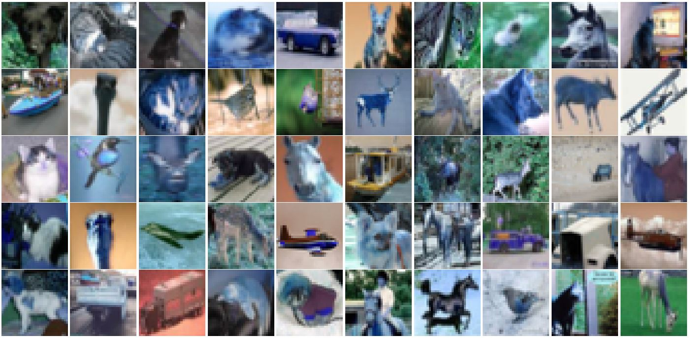

# GRAD-CAM-Visual-Explanations

This project helps to identify the misclassified images (from pre-trained ResNet18 Model trained on CIFAR10) and using GRAD CAM visualize how the network focuses on important parts fo the images to guess the final results. 

## Steps Involved:

### 1) Setup the pre-trained ResNet18 Model trained on CIFAR10
### 2) Identify 50 misclassified images from the validation set
### 3) Visualize the gallery of these 50 misclassified images
### 4) Run GRAD-CAM on these misclassified images
### 5) Visualize the gallery of these 50 misclassified images along with the GRAD CAM results

## Gallery of 50 misclassified images:

## Gallery of 50 misclassified images with GRAD-CAM:

